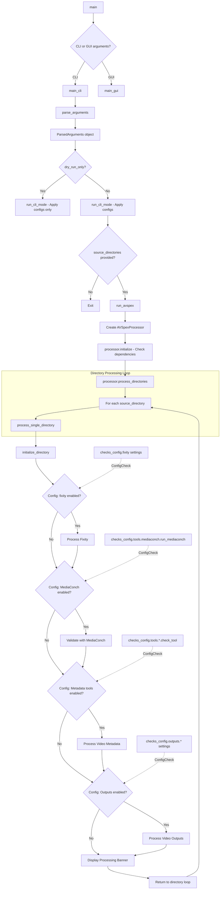
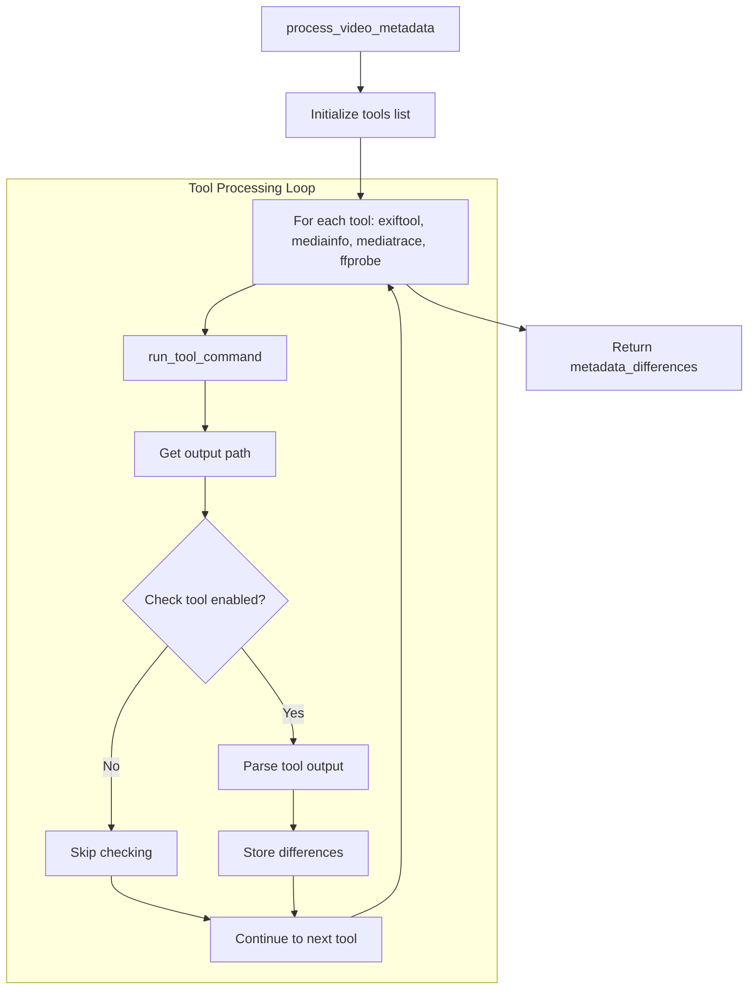
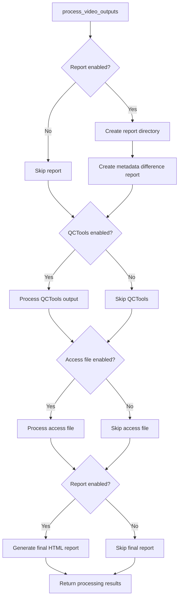

# AV Spex CLI Control Flow Documentation

## Overview

The AV Spex CLI application follows a structured control flow as visualized in the diagram below:



This document describes the control flow of the AV Spex application in CLI mode, from command-line argument processing through execution of the video processing pipeline.

The CLI implementation follows a modular architecture with clear separation of concerns:

1. Entry point (`av_spex_the_file.py`) - Parses command-line arguments and initiates processing
2. Processor (`avspex_processor.py`) - Orchestrates the processing workflow
3. Process Management (`processing_mgmt.py`) - Manages the execution of processing steps
4. Tool Running (`run_tools.py`) - Handles execution of individual analysis tools

## Entry Point: av_spex_the_file.py

The main entry point to the CLI application is `av_spex_the_file.py`, which initializes the application, parses command-line arguments, and triggers the processing workflow.

### Initialization Sequence

```python
def main():
    """Main entry point for the AV Spex application."""
    args = parse_arguments()
    
    # Initialize logging
    setup_logging(args.verbose)
    
    # Apply configuration changes from command line flags
    if args.on:
        toggle_on(args.on)
    if args.off:
        toggle_off(args.off)
    
    # Run the processing workflow
    run_avspex(args)
```

### Command-Line Argument Processing

The application uses Python's `argparse` module to define and parse command-line arguments:

```python
def parse_arguments():
    """Parse command line arguments."""
    parser = argparse.ArgumentParser(description='AV Spex: Process and analyze video files')
    
    # Input files or directories
    parser.add_argument('source', nargs='*', help='File or directory path to process')
    
    # Processing options
    parser.add_argument('--output-dir', help='Directory to store output files')
    parser.add_argument('--profile', choices=['step1', 'step2', 'full'], 
                        help='Preset configuration profile to use')
    
    # Configuration toggles
    parser.add_argument('--on', action='append', metavar='TOOL.FIELD',
                        help='Enable a specific tool or check (e.g., mediainfo.run_tool)')
    parser.add_argument('--off', action='append', metavar='TOOL.FIELD',
                        help='Disable a specific tool or check (e.g., exiftool.run_tool)')
    
    # Logging options
    parser.add_argument('-v', '--verbose', action='count', default=0,
                        help='Increase verbosity (can be specified multiple times)')
    
    return parser.parse_args()
```

### Configuration Application

Before starting the processing, any command-line configuration changes are applied to the ConfigManager:

```python
def toggle_on(tool_names):
    """Enable specified tools or checks."""
    for tool_spec in tool_names:
        try:
            tool_name, field = tool_spec.split('.')
            updates = {'tools': {tool_name: {field: 'yes'}}}
            config_mgr.update_config('checks', updates)
        except ValueError:
            logger.warning(f"Invalid format '{tool_spec}'. Expected format: tool.field")

def toggle_off(tool_names):
    """Disable specified tools or checks."""
    for tool_spec in tool_names:
        try:
            tool_name, field = tool_spec.split('.')
            updates = {'tools': {tool_name: {field: 'no'}}}
            config_mgr.update_config('checks', updates)
        except ValueError:
            logger.warning(f"Invalid format '{tool_spec}'. Expected format: tool.field")
```

### Processing Initiation

The `run_avspex()` function acts as the bridge between the command-line interface and the core processing logic:

```python
def run_avspex(args):
    """Run the AV Spex processing workflow."""
    # Apply profile if specified
    if args.profile:
        apply_profile(profiles[args.profile])
    
    # Create processor instance
    processor = AVSpexProcessor()
    
    # Process source paths
    for source_path in args.source:
        if os.path.isdir(source_path):
            processor.process_directory(source_path, args.output_dir)
        elif os.path.isfile(source_path):
            processor.process_file(source_path, args.output_dir)
        else:
            logger.error(f"Invalid source path: {source_path}")
```

This function:
1. Applies any selected profile configuration
2. Creates an instance of the `AVSpexProcessor` class
3. Processes each source path (file or directory) specified in the command line

## The AVSpexProcessor Class

The `AVSpexProcessor` class in `avspex_processor.py` serves as the orchestrator for the processing workflow, managing the execution of analysis tools and data processing operations.

### Initialization

The processor initializes by loading the configuration and setting up its state:

```python
def __init__(self):
    """Initialize the AVSpex processor."""
    self.config_mgr = ConfigManager()
    self.checks_config = self.config_mgr.get_config('checks', ChecksConfig)
    self.spex_config = self.config_mgr.get_config('spex', SpexConfig)
    
    # Track processing state
    self.current_file = None
    self.output_directory = None
    self.results = {}
```

### File Processing Flow

The main file processing method follows this sequence:

```python
def process_file(self, file_path, output_dir=None):
    """Process a single video file."""
    # Validate file
    if not os.path.exists(file_path):
        logger.error(f"File not found: {file_path}")
        return False
    
    # Set up processing state
    self.current_file = file_path
    self.file_id = self._generate_file_id(file_path)
    self.output_directory = self._prepare_output_directory(output_dir, file_path)
    
    logger.info(f"Processing file: {file_path}")
    
    # Create processing manager
    process_mgr = ProcessingManager(file_path, self.output_directory, self.file_id)
    
    # Execute processing pipeline
    result = process_mgr.run_processing_pipeline()
    
    # Store results
    self.results[file_path] = result
    
    return result.success
```

Key responsibilities:
1. Validates the input file path
2. Sets up the processing context with file ID and output directory
3. Creates a `ProcessingManager` to handle the execution details
4. Runs the processing pipeline and stores results
5. Returns success/failure status

### Directory Processing

For directory processing, the processor identifies video files and processes each one:

```python
def process_directory(self, directory_path, output_dir=None):
    """Process all video files in a directory."""
    if not os.path.isdir(directory_path):
        logger.error(f"Directory not found: {directory_path}")
        return False
    
    logger.info(f"Processing directory: {directory_path}")
    
    # Identify video files
    video_files = self._find_video_files(directory_path)
    if not video_files:
        logger.warning(f"No video files found in {directory_path}")
        return False
    
    # Process each file
    results = []
    for file_path in video_files:
        result = self.process_file(file_path, output_dir)
        results.append(result)
    
    # Return overall success if all files were processed successfully
    return all(results)
```

### Helper Methods

The processor includes several helper methods:

```python
def _generate_file_id(self, file_path):
    """Generate a unique identifier for the file."""
    # Use filename without extension as ID
    return os.path.splitext(os.path.basename(file_path))[0]

def _prepare_output_directory(self, output_dir, file_path):
    """Prepare the output directory for results."""
    if not output_dir:
        # If no output directory specified, create one next to the file
        output_dir = os.path.join(os.path.dirname(file_path), 
                                  f"{self._generate_file_id(file_path)}_analysis")
    
    # Ensure directory exists
    os.makedirs(output_dir, exist_ok=True)
    return output_dir

def _find_video_files(self, directory_path):
    """Find all video files in a directory."""
    video_extensions = ['.mp4', '.mkv', '.mov', '.avi', '.mxf']
    video_files = []
    
    for root, _, files in os.walk(directory_path):
        for file in files:
            if any(file.lower().endswith(ext) for ext in video_extensions):
                video_files.append(os.path.join(root, file))
    
    return video_files
```

These methods handle common tasks in the processing workflow:
- Generating unique IDs for files
- Setting up output directories
- Finding video files in directories

## The ProcessingManager Class

The `ProcessingManager` class in `processing_mgmt.py` is responsible for executing the processing pipeline, managing the execution of individual tools and processing steps.

### Initialization

```python
def __init__(self, file_path, output_directory, file_id):
    """Initialize the processing manager."""
    self.file_path = file_path
    self.output_directory = output_directory
    self.file_id = file_id
    
    self.config_mgr = ConfigManager()
    self.checks_config = self.config_mgr.get_config('checks', ChecksConfig)
    
    # Set up result tracking
    self.results = ProcessingResult()
    self.tool_outputs = {}
```

### Processing Pipeline Execution

The main processing pipeline method orchestrates the execution of all analysis tools and processing steps:

```python
def run_processing_pipeline(self):
    """Run the complete processing pipeline on the file."""
    logger.info(f"Starting processing pipeline for {self.file_path}")
    
    try:
        # Step 1: Run basic file checks
        self._run_file_checks()
        
        # Step 2: Run requested tools
        self._run_analysis_tools()
        
        # Step 3: Parse and validate tool outputs
        self._parse_tool_outputs()
        
        # Step 4: Generate final report
        self._generate_report()
        
        logger.info(f"Processing complete for {self.file_path}")
        self.results.success = True
        
    except Exception as e:
        logger.error(f"Processing failed: {str(e)}")
        self.results.error = str(e)
        self.results.success = False
        
    return self.results
```

This method:
1. Performs basic file validation checks
2. Runs the configured analysis tools
3. Parses and validates the tool outputs
4. Generates a final report
5. Handles any exceptions and returns results

### Tool Execution

The `_run_analysis_tools()` method manages the execution of individual analysis tools based on the configuration:

```python
def _run_analysis_tools(self):
    """Run enabled analysis tools on the file."""
    logger.info("Running analysis tools")
    
    # List of tools to run
    tools = ['mediainfo', 'ffprobe', 'exiftool', 'mediatrace']
    
    # Run each enabled tool
    for tool_name in tools:
        tool_config = getattr(self.checks_config.tools, tool_name)
        if tool_config.run_tool == 'yes':
            logger.info(f"Running {tool_name}")
            output_path = run_tool_command(
                tool_name, 
                self.file_path, 
                self.output_directory, 
                self.file_id
            )
            
            if output_path and os.path.exists(output_path):
                self.tool_outputs[tool_name] = output_path
                self.results.add_tool_result(tool_name, True)
            else:
                logger.warning(f"{tool_name} did not produce an output file")
                self.results.add_tool_result(tool_name, False)
        else:
            logger.debug(f"Skipping {tool_name} (disabled in config)")
```

For each tool in the list:
1. Checks if the tool is enabled in the configuration
2. If enabled, calls `run_tool_command()` from `run_tools.py`
3. Verifies tool execution by checking for output files
4. Records success/failure in the results

### Processing Results

The `ProcessingResult` class tracks the results of the processing pipeline:

```python
class ProcessingResult:
    """Track the results of processing a file."""
    
    def __init__(self):
        """Initialize processing results."""
        self.success = False
        self.error = None
        self.tool_results = {}
        self.validation_results = {}
        self.metadata = {}
    
    def add_tool_result(self, tool_name, success):
        """Add a tool execution result."""
        self.tool_results[tool_name] = success
    
    def add_validation_result(self, check_name, passed, details=None):
        """Add a validation check result."""
        self.validation_results[check_name] = {
            'passed': passed,
            'details': details
        }
    
    def add_metadata(self, key, value):
        """Add extracted metadata."""
        self.metadata[key] = value
```

This class provides a structured way to track:
- Overall success/failure of processing
- Results of individual tool executions
- Results of validation checks
- Extracted metadata

## Tool Execution: run_tools.py

The `run_tools.py` module handles the execution of external command-line tools to analyze the video files.

### Tool Command Execution

As shown in your provided code, the `run_command()` function executes shell commands with environment setup:

```python
def run_command(command, input_path, output_type, output_path):
    '''
    Run a shell command with 4 variables: command name, path to the input file, 
    output type (often '>'), path to the output file
    '''

    # Get the current PATH environment variable
    env = os.environ.copy()
    env['PATH'] = '/usr/local/bin:' + env.get('PATH', '')

    full_command = f"{command} \"{input_path}\" {output_type} {output_path}"

    logger.debug(f'Running command: {full_command}\n')
    subprocess.run(full_command, shell=True, env=env)
```

### Tool-Specific Command Execution

The `run_tool_command()` function handles tool-specific command construction and execution:

```python
def run_tool_command(tool_name, video_path, destination_directory, video_id):
    """
    Run a specific metadata extraction tool and generate its output file.
    """
    # Define tool-specific commands
    tool_commands = {
        'exiftool': 'exiftool',
        'mediainfo': 'mediainfo -f',
        'mediatrace': 'mediainfo --Details=1 --Output=XML',
        'ffprobe': 'ffprobe -v error -hide_banner -show_format -show_streams -print_format json'
    }

    # Check if the tool is configured
    command = tool_commands.get(tool_name)
    if not command:
        logger.error(f"tool command is not configured correctly: {tool_name}")
        return None

    # Construct output path
    output_path = os.path.join(destination_directory, 
                              f'{video_id}_{tool_name}_output.{_get_file_extension(tool_name)}')
    
    if tool_name != "mediaconch":
        # Check if tool should be run based on configuration
        tool = getattr(checks_config.tools, tool_name)
        if getattr(tool, 'run_tool') == 'yes':
            if tool_name == 'mediatrace':
                logger.debug(f"Creating {tool_name.capitalize()} XML file to check custom MKV Tag metadata fields:")
            run_command(command, video_path, '>', output_path)
        
    return output_path
```

Key aspects:
1. Defines command templates for each supported tool
2. Constructs the output file path using video ID and tool name
3. Checks the configuration to determine if the tool should be run
4. Delegates to `run_command()` for actual execution
5. Returns the output file path for further processing

## Complete Control Flow Sequence

Putting everything together, the control flow of the CLI application follows this sequence:

1. User invokes `av_spex_the_file.py` with command-line arguments
2. `main()` function:
   - Parses command-line arguments
   - Sets up logging based on verbosity level
   - Applies configuration changes from `--on` and `--off` flags
   - Calls `run_avspex()` with parsed arguments

3. `run_avspex()` function:
   - Applies any specified profile configuration
   - Creates an `AVSpexProcessor` instance
   - For each source path:
     - If directory, calls `process_directory()`
     - If file, calls `process_file()`

4. `AVSpexProcessor.process_file()`:
   - Validates the file path
   - Sets up processing state (file ID, output directory)
   - Creates a `ProcessingManager` instance
   - Runs the processing pipeline
   - Stores and returns results

5. `ProcessingManager.run_processing_pipeline()`:
   - Performs basic file checks
   - Runs enabled analysis tools via `_run_analysis_tools()`
   - Parses and validates tool outputs
   - Generates a report
   - Returns structured results

6. Tool execution in `run_tools.py`:
   - For each enabled tool, constructs command
   - Executes command via subprocess
   - Returns output file path

7. Results flow back up the call stack to the main function

This modular architecture provides separation of concerns, with each component responsible for a specific aspect of the processing workflow:
- Entry point for argument handling and flow control
- Processor for orchestrating the processing
- Process manager for executing the pipeline
- Tool runner for interfacing with external tools

## Configuration Integration

The CLI control flow integrates with the `ConfigManager` described in your existing documentation in several key ways:

1. **Initial Configuration Loading**:
   - The `AVSpexProcessor` loads both the `checks_config` and `spex_config` during initialization
   - This ensures all processing decisions respect the current configuration

2. **Command-Line Configuration Overrides**:
   - The `--on` and `--off` flags allow users to override configuration settings
   - These are applied via `toggle_on()` and `toggle_off()` functions, which use `config_mgr.update_config()`

3. **Profile Application**:
   - The `--profile` flag applies predefined configuration profiles
   - This uses the same `apply_profile()` function described in your configuration documentation

4. **Tool Configuration Checking**:
   - The `run_tool_command()` function checks the configuration to determine if a tool should be run
   - This respects the `run_tool` setting for each tool in the configuration

This tight integration ensures that the CLI behavior is consistently driven by the configuration, while still providing command-line flexibility for users.

## Metadata Processing Flow

The metadata processing component of the application is responsible for running metadata extraction tools, parsing their outputs, and identifying differences. This flow is visualized in the diagram below:



The `process_video_metadata()` function in the processing manager is responsible for:

1. Initializing a list of metadata tools to process
2. For each tool (exiftool, mediainfo, mediatrace, ffprobe):
   - Calling `run_tool_command()` to execute the tool
   - Checking if the tool is enabled in the configuration
   - If enabled, parsing the tool output and comparing against specifications
   - Storing any found differences in a dictionary
3. Returning the consolidated metadata differences

This structured approach ensures that each tool is processed consistently, while respecting the configuration settings for each tool.

## Outputs Processing Flow

The outputs processing component handles the generation of reports, QCTools processing, and access file creation based on configuration settings. This flow is visualized below:



The `process_video_outputs()` function in the processing manager follows this sequence:

1. Check if report generation is enabled in the configuration
   - If enabled, create a report directory and generate a metadata difference report
   - If disabled, skip report generation

2. Check if QCTools processing is enabled
   - If enabled, process the QCTools output (generate graphs, extract frames)
   - If disabled, skip QCTools processing

3. Check if access file creation is enabled
   - If enabled, create a lower-resolution access copy of the video
   - If disabled, skip access file creation

4. If reporting is enabled, generate a final HTML report with all findings
5. Return the processing results

Each step in this flow checks the relevant configuration settings before proceeding, ensuring that only the requested outputs are generated. This approach maximizes efficiency by skipping unnecessary processing steps based on the user's configuration.