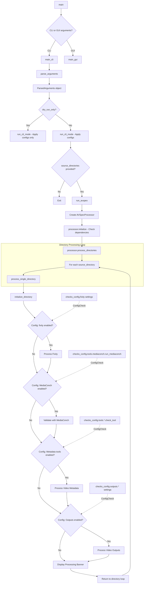

# AV Spex CLI Developer Documentation

## Overview

The AV Spex CLI application's control flow primarily follows a 'for loop' which processes input directories according to settings stored in the Checks config and Spex config:   



This document describes the control flow of the AV Spex application in CLI mode, from command-line argument processing through execution of the video processing pipeline.

The CLI implementation follows a modular architecture with clear separation of concerns:

1. Entry point (`av_spex_the_file.py`) - Parses command-line arguments and initiates processing
2. Processor (`avspex_processor.py`) - Orchestrates the processing workflow
3. Process Management (`processing_mgmt.py`) - Manages the execution of processing steps
4. Tool Running (`run_tools.py`) - Handles execution of individual analysis tools

## Entry Point: av_spex_the_file.py

The main entry point to the CLI application is `av_spex_the_file.py`, which initializes the application, parses command-line arguments, and triggers the processing workflow.

### Initialization Sequence

```python
def main():
    """Main entry point for the AV Spex application."""
    args = parse_arguments()
    
    # Initialize logging
    setup_logging(args.verbose)
    
    # Apply configuration changes from command line flags
    if args.on:
        toggle_on(args.on)
    if args.off:
        toggle_off(args.off)
    
    # Run the processing workflow
    run_avspex(args)
```

### Command-Line Argument Processing

The application uses Python's `argparse` module to define and parse command-line arguments:

```python
def parse_arguments():
    """Parse command line arguments."""
    parser = argparse.ArgumentParser(description='AV Spex: Process and analyze video files')
    
    # Input files or directories
    parser.add_argument('source', nargs='*', help='File or directory path to process')
    
    # Processing options
    parser.add_argument('--output-dir', help='Directory to store output files')
    parser.add_argument('--profile', choices=['step1', 'step2', 'full'], 
                        help='Preset configuration profile to use')
    
    # Configuration toggles
    parser.add_argument('--on', action='append', metavar='TOOL.FIELD',
                        help='Enable a specific tool or check (e.g., mediainfo.run_tool)')
    parser.add_argument('--off', action='append', metavar='TOOL.FIELD',
                        help='Disable a specific tool or check (e.g., exiftool.run_tool)')
    
    # Logging options
    parser.add_argument('-v', '--verbose', action='count', default=0,
                        help='Increase verbosity (can be specified multiple times)')
    
    return parser.parse_args()
```

### Configuration Application

Before starting the processing, any command-line configuration changes are applied to the configs via the ConfigManager.    
For more details on the ConfigManger, see the [config manager documentation](https://github.com/JPC-AV/JPC_AV_videoQC/blob/main/developer_docs/cli-documentation.md)   

```python
def toggle_on(tool_names):
    """Enable specified tools or checks."""
    for tool_spec in tool_names:
        try:
            tool_name, field = tool_spec.split('.')
            updates = {'tools': {tool_name: {field: 'yes'}}}
            config_mgr.update_config('checks', updates)
        except ValueError:
            logger.warning(f"Invalid format '{tool_spec}'. Expected format: tool.field")

def toggle_off(tool_names):
    """Disable specified tools or checks."""
    for tool_spec in tool_names:
        try:
            tool_name, field = tool_spec.split('.')
            updates = {'tools': {tool_name: {field: 'no'}}}
            config_mgr.update_config('checks', updates)
        except ValueError:
            logger.warning(f"Invalid format '{tool_spec}'. Expected format: tool.field")
```

### Processing Initiation

The `run_avspex()` function acts as the bridge between the command-line interface and the core processing logic:

```python
def run_avspex(source_directories, signals=None):
    processor = AVSpexProcessor(signals=signals)
    try:
        processor.initialize()
        formatted_time = processor.process_directories(source_directories)
        return True
```

This function creates an instance of the `AVSpexProcessor` class, and then runs the `initialize()` and `process_directories()` functions defined in that class. Since the CLI application does not pass signals to `run_avspex()` the `signals` variable is `None`.

## The AVSpexProcessor Class

The `AVSpexProcessor` class in `avspex_processor.py` serves as the orchestrator for the processing workflow.

### Benefits of Using a Class-Based Design

- **State maintenance**: Tracks overall processing state
- **Configuration access**: Centralized access to configuration data
- **Modular processing**: Clean separation of initialization and processing logic
- **Extensibility**: Easily add new processing steps or modify existing ones

### Initialization

The `initialize()` method verifies all required dependencies, using functions from the `utils.deps_setup.py` script.

From avspex_processor.py:
```python
from ..utils.deps_setup import required_commands, check_external_dependency, check_py_version

def initialize(self):
        """Check all prerequisites before processing"""
        check_py_version()
        
        for command in required_commands:
                
            if not check_external_dependency(command):
                error_msg = f"Error: {command} not found. Please install it."
                raise RuntimeError(error_msg)
        
        return True
```

This method:
- Checks Python version compatibility
- Verifies external command-line tools existence
- Returns False if any check fails

### Directory Processing

Once initialized, processing begins with:

```python
def process_directories(self, source_directories):
        overall_start_time = time.time()
        total_dirs = len(source_directories)

        for idx, source_directory in enumerate(source_directories, 1):
            
            source_directory = os.path.normpath(source_directory)
            self.process_single_directory(source_directory)

        overall_end_time = time.time()
        formatted_time =  log_overall_time(overall_start_time, overall_end_time)
            
        return formatted_time
```

This method:

- Records the overall start time
- Iterates through each source directory
- Calls `process_single_directory()` for each path
- Records the overall end time
- Returns the formatted processing time

### Processing Steps

1. **Directory Initialization**
   ```python
   init_dir_result = dir_setup.initialize_directory(source_directory)
   video_path, video_id, destination_directory, access_file_found = init_dir_result
   ```
   - Initializes the directory structure
   - Extracts relevant paths and importantly, the Video ID (the file name without extension), which is used as an identifier throughout. 
   - Returns `False` if initialization fails

2. **Processing Manager Setup**
   ```python
   processing_mgmt = ProcessingManager(signals=None, check_cancelled_fn=self.check_cancelled)
   ```
   - Creates a processing manager instance to handle tool execution.
   - Signals that can be passed to the ProcessingManager dataclass pertain to reporting status to the GUI.

   Unlike the more structural `AVSpexProcessor`, the `ProcessingManager` focuses on the _how_ of processing, implementing the specific workflow steps.

   The `ProcessingManager` contains functions that are then called in the `AVSpexProcessor`.

3. **Checks - Fixity Processing**
    The `AVSpexProcessor` passes the identifying information extracted from initialization to functions in the `ProcessingManager` if enabled in the Checks Config.   

   ```python
   fixity_enabled = False
   fixity_config = self.checks_config.fixity
   
   if (fixity_config.check_fixity == "yes" or 
       fixity_config.validate_stream_fixity == "yes" or 
       fixity_config.embed_stream_fixity == "yes" or 
       fixity_config.output_fixity == "yes"):
       fixity_enabled = True
       
   if fixity_enabled:
       processing_mgmt.process_fixity(source_directory, video_path, video_id)
   ```

   The `ProcessingManager` function in turn runs individual fixity checks, based on selected options in the Checks Config. These checks are stored in the AVSpex.checks module. GUI related signals removed for clarity.

   ```python
   from ..checks.fixity_check import check_fixity, output_fixity
   from ..checks.embed_fixity import validate_embedded_md5, process_embedded_fixity
   def process_fixity(self, source_directory, video_path, video_id):
        """
        Orchestrates the entire fixity process, including embedded and file-level operations.

        Args:
            source_directory (str): Directory containing source files
            video_path (str): Path to the video file
            video_id (str): Unique identifier for the video
        """
        
        if self.check_cancelled():
            return None
        
        # Embed stream fixity if required  
        if checks_config.fixity.embed_stream_fixity == 'yes':
            process_embedded_fixity(video_path)

        # Validate stream hashes if required
        if checks_config.fixity.validate_stream_fixity == 'yes':
            if checks_config.fixity.embed_stream_fixity == 'yes':
                logger.critical("Embed stream fixity is turned on, which overrides validate_fixity. Skipping validate_fixity.\n")
            else:
                validate_embedded_md5(video_path)

        # Initialize md5_checksum variable
        md5_checksum = None

        # Create checksum for video file and output results
        if checks_config.fixity.output_fixity == 'yes':
            md5_checksum = output_fixity(source_directory, video_path, )

        # Verify stored checksum and write results  
        if checks_config.fixity.check_fixity == 'yes':
            check_fixity(source_directory, video_id, actual_checksum=md5_checksum, )
    ```


4. **Checks - MediaConch Validation**
   The other Checks in the workflow run by `AVSpexProcessor` are similarly passed to `ProcessingManager`.
   
   ```python
   mediaconch_enabled = self.checks_config.tools.mediaconch.run_mediaconch == "yes"
   if mediaconch_enabled:
       mediaconch_results = processing_mgmt.validate_video_with_mediaconch(
           video_path, destination_directory, video_id
       )
   ```
   Because MediaConch takes a policy XML file and requires a separate function for parsing MediaConch's CSV output, it is handled separately from the other metadata tools.  

5. **Checks - Metadata Tool Processing**

    ```mermaid
    flowchart TD
        A[process_video_metadata] --> D[Initialize tools list]
        
        D --> E[For each tool: exiftool, mediainfo, mediatrace, ffprobe]
        
        subgraph "Tool Processing Loop"
        E --> F[run_tool_command]
        F --> G[Get output path]
        G --> H{Check tool enabled?}
        H -->|Yes| I[Parse tool output]
        H -->|No| J[Skip checking]
        I --> K[Store differences]
        J --> L[Continue to next tool]
        K --> L
        L --> E
        end
        
        E --> M[Return metadata_differences]
    ```

    The command line metadata applications that produces text file "Sidecars" are run in a group. Once again, enabled in the `AVSpexProcessor`, and then passed to functions from the `ProcessingManager`.

   ```python
   metadata_tools_enabled = False
   tools_config = self.checks_config.tools
   
   if (hasattr(tools_config.mediainfo, 'check_tool') and tools_config.mediainfo.check_tool == "yes" or
       hasattr(tools_config.mediatrace, 'check_tool') and tools_config.mediatrace.check_tool == "yes" or
       hasattr(tools_config.exiftool, 'check_tool') and tools_config.exiftool.check_tool == "yes" or
       hasattr(tools_config.ffprobe, 'check_tool') and tools_config.ffprobe.check_tool == "yes"):
       metadata_tools_enabled = True
   
   metadata_differences = None
   if metadata_tools_enabled:
       metadata_differences = processing_mgmt.process_video_metadata(
           video_path, destination_directory, video_id
       )
   ```
   The `process_video_metadata()` function handles calls to subprocess to run the different CLI tools, with various helper functions stored in the `run_tools.py` script managing the required command-line arguments. 
   The text file sidecar outputs from the CLI tools are then parsed using tool specific functions defined in the `AV_Spex.checks` module:

    ```python
    from ..checks.exiftool_check import parse_exiftool
    from ..checks.ffprobe_check import parse_ffprobe
    from ..checks.mediainfo_check import parse_mediainfo
    from ..checks.mediatrace_check import parse_mediatrace

        def check_tool_metadata(tool_name, output_path):
        """
        Check metadata for a specific tool if configured.
        
        Args:
            tool_name (str): Name of the tool
            output_path (str): Path to the tool's output file
            
        Returns:
            dict or None: Differences found by parsing the tool's output, or None
        """
        # Mapping of tool names to their parsing functions
        parse_functions = {
            'exiftool': parse_exiftool,
            'mediainfo': parse_mediainfo,
            'mediatrace': parse_mediatrace,
            'ffprobe': parse_ffprobe
        }

        # Check if tool metadata checking is enabled
        tool = getattr(checks_config.tools, tool_name)
        if output_path and tool.check_tool == 'yes':
            parse_function = parse_functions.get(tool_name)
            if parse_function:
                return parse_function(output_path)
        
        return None
    ```

    These parsing functions compare the outputs of the "Checks" to the expected values stored in the "Spex". 

6. **Output Generation**
    Finally any selected outputs stored in the Checks Config are created.
   ```python
   outputs_enabled = (
       self.checks_config.outputs.access_file == "yes" or
       self.checks_config.outputs.report == "yes" or
       self.checks_config.tools.qctools.run_tool == "yes" or
       self.checks_config.tools.qct_parse.run_tool == "yes"
   )
   
   if outputs_enabled:
       processing_results = processing_mgmt.process_video_outputs(
           video_path, source_directory, destination_directory,
           video_id, metadata_differences
       )
   ```
    ```mermaid
    flowchart TD
        A[process_video_outputs] --> B{Report enabled?}
        
        B -->|Yes| E[Create report directory]
        B -->|No| F[Skip report]
        
        E --> G[Create metadata difference report]
        F --> H{QCTools enabled?}
        G --> H
        
        H -->|Yes| I[Process QCTools output]
        H -->|No| J[Skip QCTools]
        
        I --> K{Access file enabled?}
        J --> K
        
        K -->|Yes| L[Process access file]
        K -->|No| M[Skip access file]
        
        L --> N{Report enabled?}
        M --> N
        
        N -->|Yes| O[Generate final HTML report]
        N -->|No| P[Skip final report]
        
        O --> Q[Return processing results]
        P --> Q
    ```

    The `process_video_outputs()` function in the processing manager follows this sequence:

    1. Check if report generation is enabled in the configuration
    - If enabled, create a report directory and generate a metadata difference report
    - If disabled, skip report generation

    2. Check if QCTools processing is enabled
    - If enabled, process the QCTools output (generate graphs, extract frames)
    - If disabled, skip QCTools processing

    3. Check if access file creation is enabled
    - If enabled, create a lower-resolution access copy of the video
    - If disabled, skip access file creation

    4. If reporting is enabled, generate a final HTML report with all findings
    5. Return the processing results

7. **Completion**
    Upon completion of the single directory loop, the CLI app outputs the video ID in ASCII art, and, if additional source directories were provided, begins the loop again.